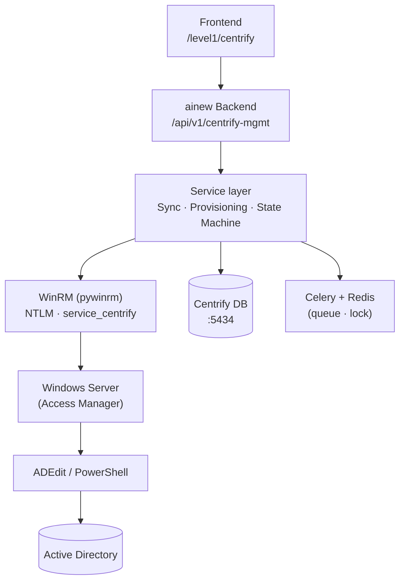

# ainew — Centrify / Delinea Server Suite Guide

Module `centrify` (**Centrify / Delinea**). Manage the Delinea Server Suite zone model (roles, commands/rights, role assignments, computer roles) from the ainew UI.

## Architecture



**Runs in ainew main backend** — not in the Dropt sidecar. Uses a **separate Postgres DB** (`centrify-db :5434`) for isolation (same pattern as Dropt). Frontend route is under `/level1/centrify` but API calls go directly to the ainew backend.

**Core architectural decision:** ainew does not connect to AD directly — no LDAP, no Kerberos. All zone management is performed through the **Windows server running Access Manager** via **WinRM**. No ADEdit or centrifydc installation is needed on ainew.

## Menus

| Menu | Path | Who | Actions |
|------|------|-----|---------|
| Zone tree | `/level1/centrify` | centrify | Tree view, detail, lists |
| Operations | `/level1/centrify/operations` | centrify | Queue, status, approval |
| Drift | `/level1/centrify/drift` | centrify | Drift alerts |
| AI Assistant | FAB/panel on Centrify page | centrify | Q&A, suggestions |
| Settings | Integrations page | admin | WinRM connection, sync interval |

## Read / write separation

- **Tree and lists** come from Centrify DB — fast, no WinRM call in the request path.
- **Synchronization** uses WinRM + PowerShell/ADEdit periodically; fetches zone objects as JSON and writes to DB.
- **Write operations** use WinRM + ADEdit/PowerShell — sends commands to the Windows server, which writes to AD.
- Post-write targeted refresh: the affected object is re-read from AD and verified against DB.

## Management states

| State | Meaning | App behavior |
|-------|---------|-------------|
| `imported_readonly` | Imported during initial sync | Read only; no writes/deletes |
| `managed` | Taken under management | Read + write + drift detection |

All objects are `imported_readonly` on first import. Authorized users switch specific objects to `managed`.

## State machine (write operations)

Every write request goes through this flow:

```
requested → pending_approval → approved → provisioning → written_to_ad → verified → completed
```

Error branches: `failed` · `ambiguous` · `cancelled` · `rolled_back`.

Due to AD replication and agent cache, activation on Linux targets may take minutes — the UI shows actual status rather than "granted".

## UI Features

### General layout
- **Left panel:** Zone tree (lazy load, collapsible)
- **Right panel:** Selected zone's content (roles, commands, computer roles, assignments, UNIX profiles)
- **Bottom panel:** Operations queue (collapsible)

### Role management
- **Clone:** Copy with all commands; choose target zone and new name
- **Overwrite:** Replace a role's commands with another role's — with diff preview
- **Diff preview:** Added (green) / removed (red) / unchanged commands + affected user count
- **Context menu (right-click / ⋮):** Edit, Clone, Import/Export Commands, Overwrite, View Assignments, Delete
- **Bulk selection:** Checkbox-based multi-select for batch operations

### Command/Right management
- Command path, run-as user, auth type, match type
- Template + allowlist security constraints
- Mandatory second approver (highest-risk operation)

### General
- Mandatory reason field (all write operations)
- Operation history and status tracking

## RBAC

Separate module (`centrify`), independent from `level1`. Granular permissions:

| Permission | Description |
|------------|-------------|
| `centrify.read` | Tree, lists, detail |
| `centrify.group_membership` | AD group membership management |
| `centrify.role_assignment` | Create/delete role assignments |
| `centrify.role_define` | Define/edit/clone/overwrite roles |
| `centrify.command_define` | Define commands/rights (highest risk) |
| `centrify.approve` | Approve operations |

Self-approval is forbidden (four-eyes principle).

## Security

- Treated as **near Tier 0** — command/right definitions have the strictest controls.
- Service account (`service_centrify`) authenticates via password with WinRM NTLM.
- **Lockout protection:** Circuit breaker trips after 2 auth failures — all operations stop. Auth errors are never automatically retried.
- User input is never interpolated into PowerShell — passed as parameters.
- Secrets stored encrypted; no secrets in code, logs, or images.
- Any Centrify failure is fully isolated from ainew (separate DB, separate Celery queue, circuit breaker).
- ainew → Windows server: WinRM only (5985/5986). No direct DC connections.

## Centrify AI Assistant

A page-specific AI assistant available only on the Centrify page:

- Delinea official documentation ingested via RAG (pgvector)
- Uses current zone, role, command, and assignment data as context
- Answers questions and provides recommendations
- Uses read-only tools only (no write operations)
- Leverages ainew's existing AI infrastructure (REMOTE_LLM or Ollama)

Example queries:
- "How do I grant dzdo permission for /usr/sbin/reboot to the oracle user?"
- "Is there a role similar to sysadmin?"
- "Is this command already defined?"

## Drift detection

For `managed` objects, the actual AD state is compared with the desired state. Differences generate alerts visible in the UI. Auto-remediation is off by default.

## Integrations link

Centrify integration requires **4 fields**:

| Field | Description |
|-------|-------------|
| Windows server | IP/hostname of the server running Access Manager |
| WinRM port | Default 5985 |
| Username | `service_centrify` |
| Password | Stored encrypted via CredentialManager |

**Note:** This is **separate** from Settings → Identity/AD configuration. AD host/port, Zone Base DN, keytab settings are not needed — the Windows server is already domain-joined with Access Manager installed.

"Test" button: WinRM connection + ADEdit availability check + zone listing.
When the configuration is active, the "Centrify" link appears in the Level 1 menu.

## Relationship with Dropt

Dropt's existing `CentrifyCredential` (hostname leave/join) **remains separate and untouched**. Two different use cases:

| Component | Purpose | Location |
|-----------|---------|----------|
| Dropt `centrify_store` | `adleave`/`adjoin` during hostname changes | Dropt backend |
| Centrify module | Zone, role, assignment management | ainew main backend |

## Phased delivery

0. **Spike** — Test WinRM connection to Windows server, validate ADEdit/PowerShell
1. **Read-only** — DB + sync + tree + lists + drift indicator
2. **Write** — State machine + queue + audit + approval + role assignment
3. **Role management** — CRUD + clone + overwrite + diff preview + computer role
4. **Command/Right** — Template + allowlist + mandatory approval
5. **AI Assistant** — RAG + chat endpoint
6. **Hardening** — Load tests, alerting, runbooks
