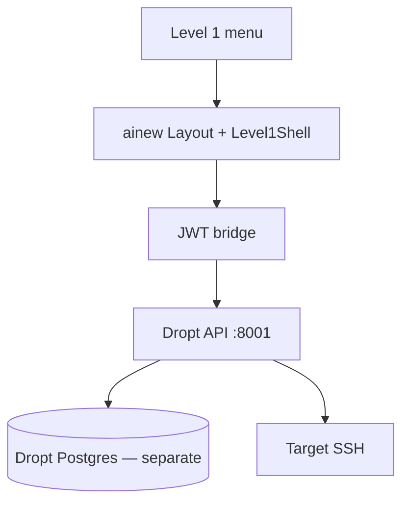

# ainew — Level 1 GUIDE

Module `level1`. Dropt embedded in ainew for day-2 Linux: requested, previewed, auditable.

`DROPT_API_URL`, `AINEW_BRIDGE_SECRET`. **Do not mix Dropt Postgres with ainew Timescale.** Map ainew/vCenter rows to Dropt `TargetServer` (IP/hostname/UUID) before opening a console.

| Menu | Path | Who | Actions |
|------|------|-----|---------|
| Ops centre | `/level1` | level1 | List, sync, console |
| Console | `/level1/console/:id` | level1 | Detail + wizards |
| Wizards | `/level1/ops/…` | level1 | Multi-select |
| Jobs | `/level1/jobs` | level1 | Queue |
| Audit | `/level1/audit` | admin | Audit trail |
| Settings | `/level1/settings` | admin | Dropt settings |

Wizards: terminal, local users, hostname, reboot, services, sudoers, filesystem/LVM, packages, path perms, logs, limits, sysctl, network/VLAN, ASM, mail.

**Flow:** Request ID → Preview → Apply → `/level1/jobs`. No auto-apply.

User management stays in ainew **Users**. Linux `/packages` is a different engine. Troubleshoot: port 8001, bridge secret, mapping, Preview required, correct Postgres.
