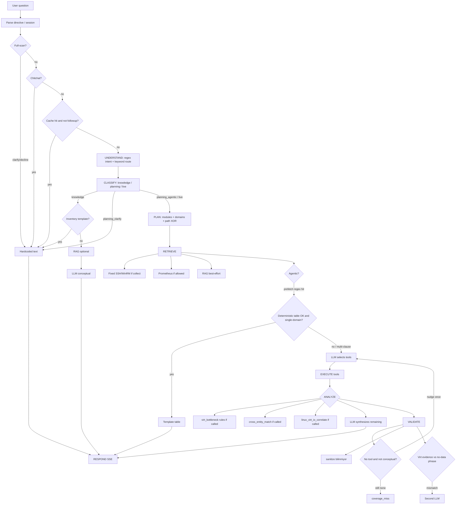
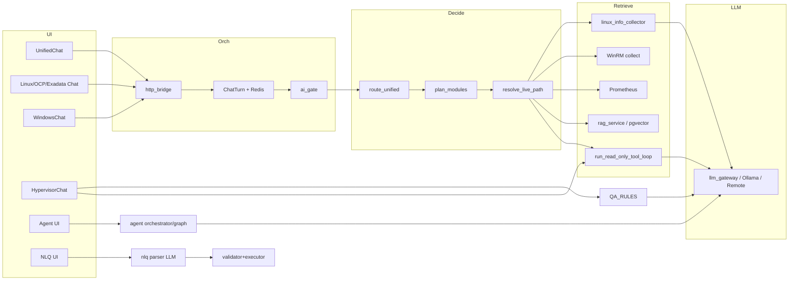
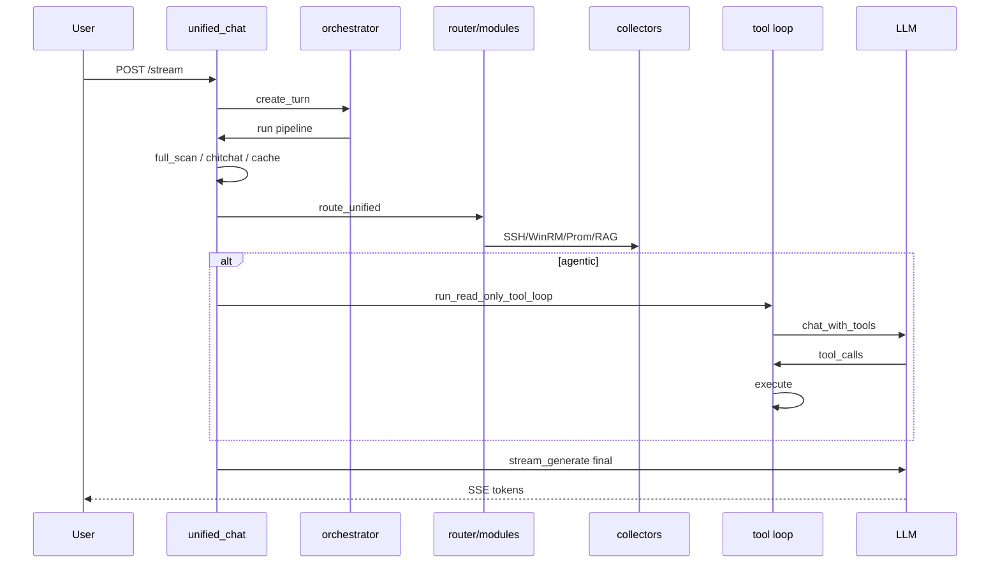
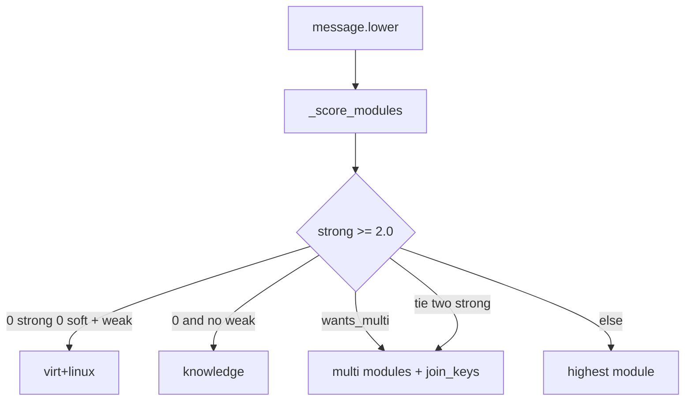

# ainew — AI Mimari GUIDE

Koddan çıkarılmış **tam** AI Architecture & Behavior Analysis. Operatör menü kılavuzu (Ana GUIDE) değildir. RAG’e yazılmaz.

Kısa ajan haritası: `.cursor/rules/ainew-ai-architecture.mdc`. Bu PDF o haritanın özeti değil; sohbette üretilen **eksiksiz** rapordur (envanter tabloları, lifecycle, domain, tool, RAG, diyagramlar).

## GÜNCELLEME ZORUNLU

Routing, tool, prompt, RAG, domain veya sohbet yaşam döngüsü değişince **bu dosyayı ve İngilizce eşini aynı turda güncelleyin.** Kısa Cursor kuralını da güncelleyin. Atlama.

| Yer | Dosya |
|-----|--------|
| TR GUIDE | `docs/guides/tr/modules/ai-architecture.md` |
| EN GUIDE | `docs/guides/en/modules/ai-architecture.md` |
| Cursor kuralı | `.cursor/rules/ainew-ai-architecture.mdc` |

Ayarlar → Hakkında → **AI Mimari** bu metni PDF yapar. Kural ile kod çelişirse ajan yanlış “gerçek” sanır.

---

# AINEW — AI Architecture & Behavior Analysis

Ürün: **ainew** (Infrastructure AI Assistant). Analiz, kodun gerçek çağrı zincirine dayanır. Tek bir “AI motoru” yoktur; **birden fazla sohbet yüzeyi + arka plan AIOps + NLQ + Agent + RAG** birlikte çalışır.

---

# 1. AI System Inventory

## 1.1 Kullanıcıya dönük AI yüzeyleri

| Component | Dosya | Class / function | Görev | Input | Output | Çağıran | Çağırdığı | Lifecycle |
|---|---|---|---|---|---|---|---|---|
| Unified Chat API | `backend/app/api/unified_chat.py` | `unified_chat_stream` | Tüm altyapı sohbeti (Linux+Windows+Virt+OCP) | `message`, `session_id`, `model`, `use_rag` | SSE token/tool/done | `frontend/src/pages/UnifiedChat.tsx` | orchestrator, `route_unified`, collect, `run_read_only_tool_loop`, `_build_prompt`, `llm_gateway` | Ana request girişi |
| Linux / OCP / Exadata Chat | `backend/app/api/chat.py` | `chat_stream` | Platform-scoped sohbet; `platform=linux\|openshift\|exadata` | mesaj, `server_ids`, `platform` | SSE | `Chat.tsx`, Servers, Events | `route_admin_question`, SSH collect, Prom, RAG, tool loop | Domain chat |
| Windows Chat | `backend/app/api/windows_chat.py` | `chat_stream` | WinRM + Event Log sohbeti | mesaj, sunucu seçimi | SSE | `WindowsChat.tsx` | WinRM collect, RAG, LLM | Domain chat |
| Virt Chat | `backend/app/api/hypervisors.py` | `ask_hypervisor_question`, `ask_hypervisor_stream` | vCenter/OV sohbeti | `question`, `session_id` | JSON veya SSE | `HypervisorChat.tsx` | `route_admin_question`, QA_RULES, `chat_source_graph`, `answer_hypervisor_question` | Domain chat |
| Chat Orchestrator | `backend/app/services/chat_orchestrator/service.py` | `create_turn`, `run_turn` | Turn kuyruğu, AI gate, SSE replay, iptal | platform, payload | `ChatTurn` + Redis events | tüm `/stream` endpoint’leri | `plan_sources`, `ai_gate`, pipeline | Request lifecycle kabuğu |
| HTTP Bridge | `chat_orchestrator/http_bridge.py` | `attach_and_stream` | Pipeline’ı turn’e bağlar, SSE yayınlar | pipeline fn | `StreamingResponse` | chat API’ler | `create_turn`, Redis stream | Transport |
| AI Gate | `chat_orchestrator/ai_gate.py` | `try_acquire` | Eşzamanlı LLM kotası | timeout | lock / queue position | `run_turn` | Redis/semafor | Concurrency |
| Agent API | `backend/app/api/agent.py` | chat/approve/reject | Mutating tool + human-in-the-loop | mesaj, onay | adımlar + final | `Agent.tsx` | `agent/orchestrator` | Ayrı otomasyon yüzeyi |
| NLQ API | `backend/app/api/nlq.py` + `nlq/pipeline.py` | `run_nlq` | Linux envanter NL→JSON→SQL | doğal dil | structured answer | inventory UI | parser LLM, validator, executor | Ayrı structured-query yolu |
| RCA API | `backend/app/api/rca.py` | compare-window, awr-analyze | Pencere karşılaştırması + AWR LLM | zaman pencereleri / AWR dosyası | analiz | RCA UI | compare_service, LLM | Ayrı analiz |
| RAG Admin API | `backend/app/api/rag.py` | ingest/search/reindex | Runbook/incident/knowledge yönetimi | PDF/text | chunk sayısı | Settings/Knowledge | `rag_service` | RAG lifecycle |
| MCP API | `backend/app/api/mcp.py` | tool call + analyze | Linux MCP tool + LLM yorum | tool+host | tool result / LLM | MCP panel | `mcp_client`, LLM | Yan yüzey |
| Knowledge API | `backend/app/api/knowledge.py` | pin/list | Manuel fact + RAG reindex | fact | persisted fact | ChatPinFact | `fact_learning`, RAG | Persistent memory yazımı |

## 1.2 Karar / planlama

| Component | Dosya | Function | Görev | Input | Output | Karar yöntemi |
|---|---|---|---|---|---|---|
| Unified Intent Router | `unified_intent_router.py` | `route_unified` | `knowledge \| planning_clarify \| planning_agentic \| live` | mesaj + followup bayrakları | `UnifiedRoute` | Rule/keyword, LLM yok |
| Module Orchestrator | `module_orchestrator.py` | `plan_modules` | linux/windows/virt/openshift/exadata seti | mesaj | `ModulePlan` | Keyword skor + düşük güvende `route_llm_hint` |
| Source Planner | `chat_source_planner.py` | `plan_sources` | db/ssh/winrm/vcenter/ocp/prom/rag | mesaj + scope | `SourcePlan` | Unified’da router’ı çağırır; diğerinde keyword |
| Path Policy | `chat_path_policy.py` | `resolve_live_path` | fixed collect XOR agentic | bayraklar | `LivePathDecision` | Keyword + settings |
| Chat Intent | `chat_intent.py` | `classify_chat_intent` | conceptual/inventory/live/mixed/general | mesaj | `ChatIntent` | Regex |
| Admin Intent Router | `admin_intent_router.py` | `route_admin_question` | Linux inventory/cmd vs Virt QA_RULES | mesaj, platform | `RouteResult` | Keyword/regex |
| Linux Chat Intent | `linux_chat_intent.py` | inventory/direct_cmd | Filo özeti, komut çıkarma | mesaj | bool / cmd list | Keyword |
| Planning Intent | `chat_planning_intent.py` | MTV/taşıma netleştirme | migrasyon kapsamı | mesaj | scope / clarify | Keyword |
| Data Fetch Ladder | `data_fetch_ladder.py` | `is_live_resource_query` | Anlık kaynak merdiveni | mesaj | bool + prompt addendum | Keyword |
| Virt Inventory Contract | `virt_inventory_contract.py` | `detect_virt_inventory_kind` | VM/datastore/ESX prefetch | mesaj | kind + fields | Regex |
| Virt Scope | `virt_scope.py` | `resolve_scope` | Entity filtre (vm/host/ds) | mesaj + DB | scope object | DB lookup + substring |
| Full Scan Policy | `chat_full_scan_policy.py` | `resolve_full_scan_turn` | Tam filo onayı | session+mesaj | clarify/decline/confirm | Keyword + session state |
| Chitchat Policy | `chat_chitchat_policy.py` | `canned_chitchat_answer` | Selamlaşma, LLM yok | mesaj | sabit metin | Keyword |
| Output Directives | `chat_output_directives.py` | `extract_output_directive` | `/table` `/json` `/brief` `/diagram` | mesaj | directive | Regex (her yerde); `/chart` alias değil |
| Tool Policy | `chat_tool_policy.py` | `should_use_db_first` | İlk 2 adımda canlı vCenter gizle | platform/domains | bool | Hardcoded |

## 1.3 Tool / LLM / yanıt

| Component | Dosya | Function | Görev |
|---|---|---|---|
| Unified Tool Loop | `unified_tool_chat.py` | `run_read_only_tool_loop` | READ_ONLY function calling (varsayılan 6 adım) |
| Tool Registry | `agent/tools.py` | `TOOLS`, `tool_specs_read_only` | Tüm tool tanımları + domain filtresi |
| Windows Tools | `agent/tools_windows.py` | `WINDOWS_TOOLS` | WinRM tool’ları |
| Agent Orchestrator | `agent/orchestrator.py` | `start_agent` | Mutating + onay; LangGraph `MAX_STEPS=8` |
| Agent Graph | `agent/graph.py` | LangGraph `llm_node`/`tools_node` | Agent akışının graph hali |
| Agent LLM | `agent/llm.py` | `chat_with_tools` | Tool-calling LLM çağrısı |
| Agent Guard/Policy | `agent/guard.py`, `policy.py` | `guard_command`, `RiskLevel` | Mutating sandbox |
| Chat Source Graph | `chat_source_graph.py` | `decide_source → execute_tools` | Virt için tool loop sarmalayıcı |
| LLM Gateway | `llm_gateway.py` | `stream_generate`, `chat`, `generate_sync` | Ollama veya REMOTE_LLM |
| LLM Availability | `llm_availability.py` | circuit breaker | Gateway down ise kes |
| LLM Usage | `llm_usage.py` | token/usage | SSE’ye usage enjekte |
| Context Budget | `llm_context_budget.py` | `budget_sections` | Token tavanı; system/soru kesilmez |
| Response Layers | `response_layers.py` | `wrap_layer` | linux_ssh / winrm / prom etiketleri |
| Answer Sanitize | `answer_sanitize.py` | `sanitize_llm_answer` | “bilinmiyor” cümlelerini siler |
| Chat Coverage | `chat_coverage.py` | `record_coverage_miss` | Kanıtsız “veri yok” telemetrisi |
| Virt Intelligence | `hypervisor_intelligence.py` | `answer_hypervisor_question`, `QA_RULES` | Deterministik virt cevap + persona LLM |
| Virt Diagnostics | `virt_diagnostics.py` | bottleneck kuralları | VM vs host kök neden (kural motoru) |
| Linux Collector | `linux_info_collector.py` | `detect_needed_groups`, `collect_server_info` | Keyword → SSH grupları |
| Infra Summary | `infra_summary.py` | `build_infra_overview_text` | Ucuz DB özeti |
| Prometheus AI | `monitoring/prometheus_metrics.py` | `get_metrics_context_for_ai` | PromQL JOIN tablosu |
| Cross Entity Match | `cross_entity_match.py` | `cross_entity_match` | hostname/vm/ip JOIN |
| Cross-domain I/O | `cross_domain_diagnostics.py` | `linux_virt_io_correlate` | Guest iowait × VM disk latency (join şart) |
| NLQ Parser | `nlq/parser.py` | `parse_question` | LLM → JSON şema |
| AIOps Engine | `aiops_engine.py` | persist + RCA | Anomali→event→incident→LLM RCA |
| Report Engine | `report_engine.py` | generate + LLM özet | Virt raporları |
| Log Analyst | `log_analyst.py` | log + LLM | Ayrı analiz |
| Custom Report Engine | `custom_report_engine.py` | tool sonuçlarından rapor | Structured tool dump |

## 1.4 RAG / bellek / cache

| Component | Dosya | Görev |
|---|---|---|
| RAG Service | `rag_service.py` | ingest, chunk, retrieve, rerank, context |
| RAG Store | `rag_store.py` | pgvector `rag_embeddings` (Chroma runtime değil) |
| Embedding | `embedding.py` | `nomic-embed-text` 768-d, Ollama/remote |
| Reranker | `reranker.py` | opsiyonel cross-encoder |
| RAG Seed | `rag_seed.py` + `docs/rag_seed/` | ürün runbook’ları |
| Chat History | `chat_history.py` | son 8 mesaj |
| Chat Cache | `chat_cache_service.py` | platform+mesaj hash, follow-up’ta kapalı |
| QA Cache | `qa_cache.py` | virt deterministic/LLM cache |
| Episode Memory | `episode_memory.py` | Redis 45 dk canlı keşif özeti |
| Fact Learning | `fact_learning.py` | SSH’den kalıcı LearnedFact |
| Assistant Playbooks | `assistant_playbooks.py` | başarılı tool zincirini hatırla |
| Chat Cancel | `chat_cancel.py` | Redis iptal bayrağı |

## 1.5 LLM / model / prompt / vector DB — özet

- **LLM:** `llm_gateway` → yerel Ollama **veya** `REMOTE_LLM_*` OpenAI-uyumlu. Unified ayrıca Groq/OpenAI/OpenRouter doğrudan stream eder. Tool loop aynı sağlayıcıya `chat_sync` ile gider (anahtar varsa); Anthropic Messages tool yok.
- **Model seçimi:** `resolve_model_for_tier("fast"|"strong")` — knowledge/simple → fast; live/planning → strong.
- **Prompt:** statik SYSTEM_PROMPT + dinamik persona/context/history/tool.
- **RAG:** evet, 4 koleksiyon, pgvector.
- **Embedding:** `nomic-embed-text`, 768.
- **Vector DB:** PostgreSQL/TimescaleDB `rag_embeddings` + pgvector. Chroma yalnızca migrate kaynağı.
- **Agent / Planner / Router:** evet, ama planner LLM değil; keyword + module skor.
- **Intent / domain:** regex/keyword; düşük güvende `route_llm_hint` (tam classifier değil). NLQ parser ayrı.
- **Tool calling:** evet (`chat_with_tools`). Chat yüzünde yalnız READ_ONLY.
- **Memory:** session DB + Redis episode + LearnedFact + playbook + RAG knowledge.
- **Cache:** Postgres chat cache + virt QA cache + Redis API TTL.
- **Guardrails:** domain tool filtresi, DB-first, evidence nudge, sanitize, coverage miss, agent mutating onay, fleet cap.
- **Logging:** `ChatTiming`, coverage misses, LLM usage, audit (NLQ/agent).

---

# 2. Current AI Architecture

Koddan gerçek Unified Chat akışı:

```diagram
User (UnifiedChat.tsx)
  → POST /api/v1/unified-chat/stream
  → attach_and_stream
  → create_turn (plan_sources → ChatTurn + Redis)
  → run_turn (ai_gate lock)
  → unified_chat.pipeline
       1. extract_output_directive
       2. session + ChatMessage(user)
       3. full_scan_policy  → clarify/decline ise LLM YOK, return
       4. canned_chitchat   → LLM YOK, return
       5. history (son 8)
       6. chat_cache        → hit ise LLM YOK, return
       7. route_unified
            → planning_needs_clarification?
            → planning_scope / MTV?
            → is_knowledge_only?
            → else plan_modules (keyword skor; düşük güvende route_llm_hint)
       8. inventory fast-path (infra_summary) → LLM YOK, return
       9. mention + live_collect_policy (SSH/WinRM hedefleri)
      10. resolve_live_path (collect XOR agentic)
      11. paralel: Linux SSH / WinRM / Prometheus / RAG
      12. context birleştir (overview + live + facts + apps + RAG + playbook + episode)
      13. if run_agentic:
            run_read_only_tool_loop
              → prefetch (snapshot / virt inventory)
              → varsa deterministic tablo → LLM YOK, return
              → LLM tool loop (max_steps)
              → tool sonuçları context’e eklenir
      14. episode_memory.save
      15. apply_context_char_budget
      16. _build_prompt
      17. llm_gateway.stream_generate (veya Groq/OpenAI/OpenRouter)
      18. ChatMessage(assistant) + optional cache
      19. SSE done
```

**Önemli gerçek:** “Router → Context → Tool → LLM → Response” tahmini eksik. Sistemde **erken çıkışlar** (chitchat, cache, inventory, planning clarify, virt deterministic tablo) LLM’i tamamen atlar. Tool loop **bazen** final cevabı da kendisi üretir (`deterministic_answer`).

Virt chat farklıdır: QA_RULES regex → handler (LLM yok) → yoksa report → yoksa `build_context` + LLM; yanında agentic tool loop kanıt ekler.

Linux chat: admin router (inventory/direct_cmd) → keyword SSH/Prom → collect XOR agentic → prompt → LLM.

Agent sayfası ayrı: LangGraph tool loop + mutating onay.

---

# 3. AI Request Lifecycle

| # | Aşama | Unified’da var mı? | Nasıl |
|---|---|---|---|
| 1 | Request | Var | SSE + `ChatTurn` + Redis events |
| 2 | Query parsing | Kısmi | `/table` `/json` `/brief` `/diagram` (regex, her yerde); virt typo normalize; NLQ’da LLM JSON parse |
| 3 | Intent detection | Var | `classify_chat_intent` + `route_unified` + admin router — **regex/keyword** |
| 4 | Domain detection | Var | `plan_modules` keyword skor + düşük güvende `route_llm_hint` |
| 5 | Entity extraction | Kısmi | `_servers_mentioned_in_message`, `virt_scope`, VM name substring, NLQ filters |
| 6 | Context creation | Var | overview + SSH/WinRM + Prom + RAG + facts + episode + tools |
| 7 | Tool selection | Hibrit | Domain filtresi kural; hangi tool = **LLM**; bazı prefetch = regex |
| 8 | Tool execution | Var | `Tool.execute` / SSH / vCenter / OCP / DB |
| 9 | Data retrieval | Var | DB sync, live API, SSH, Prom, RAG |
| 10 | Data processing | Kısmi | field projection, virt render, Prom JOIN, bottleneck kuralları |
| 11 | RAG | Var | best-effort, live bitince beklenmez |
| 12 | LLM call | Koşullu | early-exit ve deterministic yollarda yok |
| 13 | Result interpretation | Hibrit | virt_bottleneck/QA_RULES kural; çoğu zaman LLM |
| 14 | Validation | Hibrit | evidence nudge + Unified/virt final retry; `data_status`; coverage miss UI; Unified kanıt rozeti (`chat_evidence_badge`); şema doğrulama yok (NLQ hariç) |
| 15 | Response generation | Hibrit | LLM stream **veya** şablon tablo/metin |
| 16 | Final response | Var | SSE token + DB persist |

**Sistemde olmayan / çok zayıf aşamalar**

- Tam LLM intent/domain classifier yok (yalnız düşük güven ikinci fikir: `route_llm_hint`)
- Genel entity NER yok
- Çok adımlı planner (görev grafı) yok; “planner” keyword + max_steps
- Tool sonucu için formal sufficiency checker yok (LLM “yeter” der veya max_steps biter)
- Cross-domain otomatik correlation motoru yok (`virt_bottleneck`, `cross_entity_match`, join şartlı `linux_virt_io_correlate` hariç)
- Model confidence skoru yok. Unified’da kanıt rozeti var (`chat_evidence_badge`: high/medium/low; kavramsal gizli)
- Hallucination için groundedness scorer yok
- Rerank sonrası relevance eşiği ile “RAG kullanma” kararı yok

---

# 4. AI Decision Points

| Karar | CURRENT DECISION METHOD |
|---|---|
| Chitchat mı? | Keyword (`chat_chitchat_policy`) |
| Tam filo taraması mı? | Keyword + session pending (`chat_full_scan_policy`) |
| Knowledge-only mı? | Keyword + `classify_chat_intent` regex |
| Planning/MTV mı? | Keyword (`chat_planning_intent`) |
| Hangi domain/modül? | Keyword skor (`plan_modules`); conf≤0.70 ise isteğe bağlı LLM ikinci fikir (`route_llm_hint`, auto_explore daralmaz) |
| Multi-domain mı? | ≥2 strong keyword, JOIN/migrate kelimeleri, VM+guest/SSH, zayıf genel kelime → virt+linux |
| Live data gerekli mi? | Router `need_live`; path policy; mention/filo kelimesi |
| SSH/WinRM collect mi agentic mi? | `resolve_live_path` — XOR; `force_both` yalnız named target + anlık kaynak |
| Prometheus? | Module plan `need_prometheus` + `_PERF` kelimeleri; virt-only kapalı |
| RAG? | `use_rag` flag + `route.need_rag`; chitchat’te kapalı |
| Hangi RAG koleksiyonu? | Intent keyword (`_rag_collections`) |
| Hangi model tier? | knowledge/simple → fast; else strong |
| Agentic açılsın mı? | runtime flag + `need_live` (Groq/OpenAI/OpenRouter anahtarlıysa tool loop açık; Anthropic kapalı) |
| Hangi tool şeması? | `domains_for_platform` ∩ `route.domains` |
| DB-first? | platform virt veya domain vcenter — hardcoded |
| Prefetch hangi virt tool? | `detect_virt_inventory_kind` regex |
| Snapshot tool zorla? | snapshot+boyut regex |
| LLM tool seçimi | **LLM function calling** |
| Aynı tool tekrar? | Hardcoded max 2 aynı (name, args) |
| Tool’suz cevap? | Intent ≠ conceptual ise 1 kez evidence nudge |
| Deterministic tablo yeter mi? | Prefetch `ok` + tek domain; cross-clause varsa LLM’e devam |
| Multi-tool sentez? | ≥2 başarılı farklı tool → tablo early-stop yok |
| Context’e ne girer? | Kod sırası sabit; bütçe history/context keser |
| LLM çağrılsın mı? | Early-exit / deterministic yoksa evet |
| Sonuç güvenilir mi? | Prompt kuralları + virt evidence retry + sanitize; skor yok |
| Fallback | Tool loop hata → collect context ile devam; LLM hata → `(Hata: …)`; RAG fail → boş dict |

---

# 5. Domain Architecture

## Domain detection (ortak)

`module_orchestrator._STRONG` / `_WEAK` keyword sözlükleri. LLM yok. Belirsizlikte kullanıcıya sorulmaz; `auto_explore:virt+linux` veya en yüksek skorlu single açılır.

## VMware / vCenter

| Konu | Gerçek |
|---|---|
| Detection | vcenter, vsphere, esxi, vmware, datastore, snapshot, `vm` regex, vb. |
| Tools | `db_list_*`, `db_metric_trend`, `virt_health_overview`, `virt_bottleneck_diagnose`, `vcenter_*`, `vcenter_property_read` |
| Context | `infra_overview` virt özeti; hypervisor chat’te `build_context` büyük DB dump |
| Prompt | Unified SYSTEM_PROMPT virt kuralları; `_VIRTUALIZATION_PERSONA`; module persona |
| RAG | Genel koleksiyonlar; virt-specific collection yok. Seed: `docs/rag_seed/VIRT-*.md` |
| APIs | vCenter REST/SOAP (`vcenter_client`), QueryPerf, property collector; sync’li DB |
| LLM’e aktarım | Tool JSON → text; veya QA_RULES markdown; veya `build_context` dump |

## OpenShift

| Konu | Gerçek |
|---|---|
| Detection | openshift, ocp, k8s, pod, namespace, kubevirt, mtv, … |
| Tools | `openshift_ask`, `list_ocp_*`, `ocp_*`, `kubevirt_*`, `db_list_ocp_*` |
| Context | Linux chat `platform=openshift` SSH/Prom kapatır |
| Prompt | `_PLATFORM_HINTS["openshift"]` |
| RAG | Seed `OCP-*.md`; ayrı vektör namespace yok |
| APIs | OpenShift/K8s + KubeVirt client. Ayrı `/openshift/ask` yok; sohbet `POST /chat/stream` + `platform=openshift` |
| LLM | Tool JSON text |

## Exadata / Oracle

| Konu | Gerçek |
|---|---|
| Detection | exadata, cell server, asm diskgroup, oracle rac cell |
| Tools | `exadata_health_overview`, `db_list_exadata_racks`, `db_list_exadata_nodes` (domain `exadata`). Linked compute için Linux `get_*` kalır (`{exadata, linux, infra}`) |
| Context | `infra_overview` exadata filtresi; rack/node DB; `get_exadata_server_ids` |
| Prompt | `_PLATFORM_HINTS["exadata"]` — DB-first; cellcli/ASM uydurma yasağı |
| RAG | Genel |
| APIs | Envanter DB (`exadata_inventory.py`); SSH yalnız linked server; RCA AWR ayrı UI |
| LLM | Tool JSON + isteğe bağlı host OS SSH |

**Sınır:** Canlı cellcli / ASMCMD / AWR sohbet tool’u yok. Cell CPU/ASM IOPS uydurulmaz. `cell_disk_info` varsa envanter JSON’dur.

## Linux

| Konu | Gerçek |
|---|---|
| Detection | rhel, systemd, journalctl, ssh, lvm, … |
| Tools | `get_*`, `run_diagnostic`, logs, LVM, packages; mutating yalnız Agent |
| Context | `linux_info_collector` grupları; Prom JOIN; LearnedFact; discovered apps |
| Prompt | Linux sysadmin persona |
| RAG | Seed `LINUX-*.md` |
| APIs | SSH (Paramiko), Prometheus |
| Extra | NLQ ayrı hat (structured inventory) |

## Performance / Monitoring

Ayrı modül değil. Tetik: `_PERF` / `_LIVE_RESOURCE_KW` / deep keywords.

- Linux/Windows: Prometheus `get_metrics_context_for_ai` (tek JOIN tablosu; scrape’e dokunulmaz)
- Virt: `vcenter_perf_query` + `db_metric_trend` + `virt_vm_metrics` / host metrics
- Tool: `prometheus_query` (domain `infra`)

## Cross-Domain

`plan_modules` multi + `persona_addendum` (JOIN anahtarları) + `cross_entity_match` + join şartlı `linux_virt_io_correlate` (guest iowait × VM disk latency, aynı pencere) + LLM sentezi. Graph / genel correlation engine yok.

---

# 6. Cross-Domain Behavior

Örnek: *“VM neden yavaş? VMware, Linux ve storage’ı birlikte analiz et.”*

1. **Domain:** `vm` → virt; “yavaş” zayıf; “linux”/guest yoksa bile zayıf kelimeler `auto_explore:virt+linux` veya live-resource merdiveni `virt+linux` açabilir. “storage/datastore” virt’i güçlendirir.
2. **VMware:** agentic `db_list_vms` / `db_vm_detail` / `vcenter_perf_query` / **`virt_bottleneck_diagnose`** (VM+host zaman serisi, kural motoru).
3. **Linux:** mention veya filo yoksa Unified **otomatik filo SSH açmaz**. Guest SSH için hedef adı veya merdiven + agentic `get_*` gerekir; sunucu çözülmezse tool `Hedef sunucu bulunamadı`.
4. **Storage:** virt datastore DB (`db_list_datastores`) + disk latency metrikleri. Bağımsız SAN/array API yok.
5. **Performance:** virt-only ise Prom kapalı; linux açıksa Prom dene, yoksa merdiven SSH’ye iner.
6. **Birleştirme yeri:** `unified_chat` context string + tool_text; LLM final sentez. JOIN sözleşmesi prompt’ta (`join_keys=vm_name,hostname,ip`). `cross_entity_match` isim/IP ile DB join.
7. **Correlation:** Virt katmanında `virt_diagnostics` (VM ready vs host CPU vs disk latency). Linux×virt I/O için `linux_virt_io_correlate`: kanıtlı join (same_row / name / ip / hypervisor_id) + aynı saat penceresi; join veya bir metrik yoksa `PARTIAL` / `SUCCESS_EMPTY`, korelasyon uydurulmaz.
8. **RCA:** Chat içinde otomatik AIOps RCA yok. AIOps arka planda incident için ayrı LLM çağırır.

**Sonuç:** Cross-domain = “birden fazla tool domain’ini LLM’e aç + prompt’ta JOIN et”. Sistematik multi-SoT kök neden grafı yoktur.

---

# 7. AI TOOL INVENTORY

Çağıran (chat): **LLM function calling** (`chat_with_tools`), domain seti router/platform ile kısıtlı. Planner tool seçmez. Router tool çalıştırmaz. Regex prefetch bazı virt tool’ları LLM’den önce çağırır.

### Infra / cross

| Tool | Function | Kaynak | Domain | Amaç |
|---|---|---|---|---|
| `infra_overview` | `_infra_overview_handler` | Postgres | infra | Platform envanter özeti |
| `cross_entity_match` | `_cross_entity_match_handler` | servers/HV | infra+… | İsim/IP join |
| `linux_virt_io_correlate` | `_linux_virt_io_correlate_handler` | metric_data + virt_vm_metrics | linux+vcenter | Guest iowait × VM disk latency |
| `infra_report` | `_infra_report_handler` | report engines | infra | Kapasite/risk raporu |
| `knowledge_search` | `_knowledge_search_handler` | RAG | infra | Runbook/knowledge |
| `prometheus_query` | `_prometheus_query_handler` | Prometheus | infra | PromQL |
| `db_list_critical_events` | handler | SystemEvent | infra | Kritik olaylar |

### VMware DB / analiz

| Tool | Kaynak | Amaç |
|---|---|---|
| `db_list_vms` | servers/virt inventory | VM listesi + disks |
| `db_vm_detail` | DB | Tek VM |
| `db_list_datastores` | virt_datastores | Kapasite |
| `db_list_esx_hosts` | host inventory+metrics | ESXi join |
| `db_list_clusters` | virt_clusters | HA/DRS + `ha_verdict` |
| `db_metric_trend` | Timescale virt metrics | Trend / days_to_threshold |
| `virt_bottleneck_diagnose` | virt_vm_metrics + host | VM vs host kök neden |
| `virt_health_overview` | DB aggregates | Sağlık özeti |
| `vcenter_property_read` | vCenter SOAP/property | Dinamik property |
| `db_virt_alarms` | DB | Alarmlar |
| `db_virt_cross_match` | DB JOIN | host+VM+ds+alarm |

### VMware live

| Tool | Kaynak | Amaç |
|---|---|---|
| `vcenter_ask` | vCenter API | Serbest canlı sorgu |
| `vcenter_live_alarms` | vCenter | Anlık alarm |
| `vcenter_live_tasks` | vCenter | Anlık task |
| `vcenter_perf_query` | QueryPerf | Anlık CPU/disk/net |
| `vcenter_snapshot_summary` | SOAP | Filo snapshot |
| `vcenter_list_vm_snapshots` | SOAP | Per-VM gerçek byte |

### OpenShift / KubeVirt

| Tool | Kaynak |
|---|---|
| `db_list_ocp_nodes` / `db_list_ocp_projects` | DB cache |
| `openshift_ask` | OCP API |
| `list_ocp_pods` / `list_ocp_events` | K8s API |
| `ocp_cluster_status` | ClusterOperators/CV |
| `ocp_storage_overview` | PV/PVC/SC |
| `ocp_network_overview` | NAD/Multus |
| `ocp_resource_quota` | RQ/LR |
| `list_kubevirt_vms` / `kubevirt_vm_detail` / `kubevirt_snapshots` | KubeVirt |
| `list_datavolumes` / `list_ocp_migrations` | CDI / LM |

### Linux SSH (chat’te READ_ONLY)

`get_system_summary`, `get_disk_usage`, `get_large_directories`, `get_processes`, `get_service_status`, `get_service_logs`, `get_network_status`, `get_package_status`, `get_security_events`, `get_failed_services`, `get_stuck_processes`, `get_reboot_info`, `get_kernel_errors`, `get_admin_diag_snapshot`, `get_security_patch_status`, `get_mount_health`, `run_diagnostic`, `read_service_logs`, `lvm_info`, `list_free_disks`, `execute_approved_command`

### Linux mutating (yalnız Agent HITL)

`restart_service`, `update_packages`, `clean_logs`, `manage_lvm`

### Windows (`tools_windows.py`)

`win_diagnostic`, `win_read_event_logs`, `win_run_powershell`, `win_list_updates` (read); `win_manage_service`, `win_install_updates` (mutating, Agent)

### Agent-only

`ask_user` — chat loop’da reddedilir; Agent’ta duraklatır.

### Exadata (DB, READ_ONLY)

| Tool | Kaynak | Amaç |
|---|---|---|
| `exadata_health_overview` | exadata_racks/nodes | Rack/node sağlık özeti |
| `db_list_exadata_racks` | exadata_racks | Rack/model/datacenter |
| `db_list_exadata_nodes` | exadata_nodes | compute / cell / IB |

Canlı cellcli/ASMCMD yok. `connection_config` tool çıktısına girmez.

---

# 8. Data Sources

| Kaynak | Veri | Canlı? | Yapı | AI tüketimi |
|---|---|---|---|---|
| Postgres `servers` | OS, AI-ready, VM guest alanları | Sync (dakikalar) | Yapısal | overview, NLQ, mention, facts |
| virt_* / hypervisor_* | VM/host/ds/cluster/alarm | Sync + bazı live | Yapısal | db_* tools, QA_RULES, build_context |
| Timescale virt/host metrics | CPU ready, latency, balloon | Periyodik collect | Zaman serisi | trend, bottleneck |
| vCenter REST/SOAP | inventory, perf, snapshots, tasks | Canlı | Yapısal | live tools, prefetch |
| OpenShift/K8s/KubeVirt API | pod, event, VM, quota | Canlı | Yapısal | ocp/kubevirt tools |
| OCP DB cache | nodes/projects | Sync | Yapısal | db_list_ocp_* |
| SSH | komut çıktısı | Canlı | Yarı yapısal | collector + get_* |
| WinRM | PS/event | Canlı | Yarı yapısal | windows collect/tools |
| Prometheus | node_* JOIN tablo | Canlı (~scrape) | Yapısal | context + prometheus_query |
| SystemEvent / Incident | anomali, RCA | Near-real | Yapısal | db_list_critical_events, RAG incidents |
| LearnedFact | kararlı config | Kalıcı | Yapısal | prompt “önceden öğrenilmiş” |
| rag_embeddings | runbook/incident/metric/knowledge | Batch | Unstructured + vector | RAG blokları |
| Redis | turn events, cancel, episode, API cache | Ephemeral | Key/stream | orchestration, follow-up |
| AWR upload | Oracle wait/SQL | On-demand | Parse edilmiş | RCA API, chat tool değil |
| ExadataRack/Node | rack/node envanter | CRUD/sync | Yapısal | `db_list_exadata_*` / `exadata_health_overview`; canlı cell metrik yok |

---

# 9. RAG Architecture

**Nerede:** `rag_service.get_rag_context_for_message` — Unified/Linux/Windows collect’te; tool `knowledge_search`; admin `/rag`.

**Dokümanlar**

1. `runbook` — PDF/text, `docs/rag_seed/*`
2. `incidents` — SystemEvent/Incident reindex
3. `metric_descriptions` — varsayılan metrik sözlüğü
4. `knowledge_facts` — LearnedFact + pin

**Pipeline**

- Chunk: 800 char, 100 overlap, paragraf/cümle sınırına yakın
- Embed: tek sorgu vektörü, 4 koleksiyon aynı vektörle
- Store: pgvector cosine, dim 768
- Retrieval: vector + lexical hybrid (`query_collection` / `lexical_search_collection`)
- Rerank: opsiyonel, `rag_reranker_candidates`
- Filtering: Unified planner koleksiyon seçer; Linux/OCP/Exadata stream **dört koleksiyonu** da çeker; zero embedding atılır
- Metadata: title, page, chash
- Context: `RUNBOOK:`, `BENZER OLAYLAR:`, `METRIK ACIKLAMALARI:`, `BILGI BANKASI / RAG:`
- LLM’e: context_str içinde; system’den ayrı

**RAG’e gidenler:** knowledge/howto, troubleshooting, live (need_rag=True varsayılan), `use_rag=true`.

**Gitmeyenler:** chitchat; `use_rag=false`; inventory fast-path; planning_clarify; virt QA_RULES hit; skip_ctx; embed fail (sessiz boş).

**Canlı metrik soruları RAG’e de gider** ama prompt “RAG ile metrik uydurma” der. Ayrı bir “bu soru RAG değil” kapısı yok.

---

# 10. Live Data Architecture

**Kaynaklar:** SSH, WinRM, vCenter live, OCP/KubeVirt, Prometheus, (DB sync near-live).

**API’yi kim çağırır:** Tool `direct_handler` veya `linux_info_collector` / windows collect. Orchestrator HTTP çağırmaz.

**Tool’u kim çağırır:** LLM (çoğu); regex prefetch (virt inventory, snapshot boyutu).

**Canlı gerektiğine kim karar verir:** `route_unified.need_live` + `apply_live_collect_policy` (mention/filo) + `resolve_live_path` + tool politikası.

**Sonuç işleme:** JSON → 48k char text → messages tool role → bazen deterministic markdown.

**LLM’e aktarım:** tool loop içinde multi-turn; bitince `ARAÇ SONUÇLARI` bloğu final prompt’a.

**Tool fail:** `ok:false` + error JSON; LLM devam eder veya “canlı sorguda kayıt dönmedi”. Aynı çağrı 2 kez sonra blok.

**Veri yok:** `data_status` (SUCCESS / SUCCESS_EMPTY / FAILED / TIMEOUT / NOT_QUERIED / STALE); collection_summary `STATUS=`; prompt yasağı; nudge; virt+Unified final retry; coverage miss (Ayarlar → Hakkında); Unified kanıt rozeti (high/medium/low; kavramsal gizli — model güveni değil).

**“Live data unavailable”:** İngilizce sabit string yok. Üretilen Türkçe kalıplar:

- `unified_chat` collection_summary: “canlı veri toplanamadı (zaman aşımı/bağlantı)”
- LLM’in ürettiği “canlı veri mevcut değil” — `chat_coverage._NO_DATA_PATTERNS` bunu yakalar
- Virt **ve Unified final**: evidence varken bu cümle gelirse ikinci LLM; olmazsa ham kanıt. Unified SSE `replace_answer`.
- Cache: “veri yok” cevapları cache’e yazılmaz / hit yok sayılır

---

# 11. Context Architecture

Final Unified prompt (`_build_prompt`):

1. **System (kesilmez):** Senior Infrastructure Architect kimliği + rol değişimi + yetenekler + OV/vCenter terimleri + yanıt kuralları + `TOPLAMA DURUMU`
2. **BAGLAM (kesilebilir):** overview, fleet notes, inventory lines, wrapped SSH/WinRM/Prom, learned facts, discovered apps, RAG, playbook, episode, tool results
3. **ONCEKI KONUSMA (kesilebilir):** son 8 mesaj
4. **Protected tail (kesilmez):** `KULLANICI SORUSU` + `/table` `/json` `/brief` `/diagram` direktifi + `YANIT:`

Tool loop ayrıca kendi system’ini kurar: `SYSTEM_PROMPT` + platform hint + persona_addendum + ladder + DB-first + planning + server list (4k) + budgeted context (12k default) + inventory addendum.

**Token budget:** `llm_context_token_budget` (default 32768), `llm_context_hard_cap_tokens`, ~3 char/token kalibrasyon, 4096 rezerv, 2000 safety. Gateway öncesi `enforce_prompt_budget`.

**Filtering:** domain tool filtresi; virt `fields`; “bilgi kirliliği yasağı” prompt’ta.

**Compression/summarization:** LLM özet yok; kesme var. Kesilince modele `[CONTEXT KESİLDİ … 'canlı veri yok' DEME]` notu eklenir. Episode `summarize_live_context` (45 dk).

**Query-specific:** evet — collector grupları, Prom preset/detay/kapsamlı, virt fields, RAG collections.

---

# 12. Prompt Architecture

| Prompt | Nerede | Kim | Amaç | Static/Dynamic |
|---|---|---|---|---|
| Unified identity+rules | `unified_chat._build_prompt` | Final LLM | Mimari kimlik, çapraz analiz | Static + collection_summary + directive |
| Diagram addendum | `chat_output_directives` DIAGRAM | Final / tool LLM | Mermaid fence + kısa yorum (2–4 madde); tip LLM’de; etiketlerde markdown yasak; SVG/xychart yok | Static (ekstra çağrı yok) |
| Tool SYSTEM_PROMPT | `unified_tool_chat.py` ~160 satır | Tool loop | Platform/tool kuralları, kanıt yasağı | Static + hints + addenda |
| `_PLATFORM_HINTS` | aynı | Tool loop | linux/ocp/win/virt/exadata izolasyonu | Static, domain’e göre eklenir |
| Module `persona_addendum` | `module_orchestrator` | Tool loop | Tek/çok modül uzman + JOIN | Dynamic |
| Ladder addendum | `data_fetch_ladder` | Tool/final | DB→Prom→vCenter→SSH sırası | Dynamic |
| DB-first addendum | `chat_tool_policy` | Tool loop | Önce db_* | Static |
| Planning addenda | `chat_planning_intent` | Tool loop | MTV read-only | Static |
| Evidence nudge | `unified_tool_chat` | 2. şans | Araçsız cevap yasağı | Static |
| Virt persona | `hypervisor_intelligence._VIRTUALIZATION_PERSONA` | Virt LLM | Virt uzmanı | Static |
| Agent SYSTEM_PROMPT | `agent/orchestrator.py` | Agent | Linux/Win teşhis + mutate onay | Static |
| NLQ SYSTEM_PROMPT | `nlq/parser.py` | NLQ | JSON şema, uydurma yasağı | Static + field list |
| Report prompt | `answer_report_question` | Virt rapor | Markdown özet | Dynamic report body |
| Conceptual virt | `_compute_hypervisor_answer` | Virt | Eğitim, envanter yok | Static + history |

System vs runtime: kurallar system’de; envanter/tool/RAG/history ayrı bölüm. Bütçe system’i korur.

Prompt büyümesi: tool text 48k, OCP pod TSV şişebilir, multi-domain context 32k’yı zorlar — merkezi kesme var.

---

# 13. Memory / Conversation

| Katman | Süre | Kullanım |
|---|---|---|
| `ChatSession` / `ChatMessage` | Kalıcı | UI + son 8 history |
| Follow-up flag | Tur | cache kapalı; history enjekte |
| Episode Redis | 45 dk | Kısa follow-up’ta collect atlanabilir |
| Playbooks | DB | Benzer soruda tool ipucu |
| LearnedFact | Kalıcı | Kararlı config; canlı çelişirse canlı kazanır |
| Knowledge pin | Kalıcı + RAG | Admin düzeltme |
| Chat/QA cache | TTL | Follow-up/directive’de kapalı; no-data cache yok |
| Agent transcript | Action kaydı | Onay sonrası devam |
| Cross-session memory | Yok | Kullanıcı profili yok |

Önceki tool sonuçları kalıcı saklanmaz; episode özeti ve history metni vardır.

---

# 14. Response Generation

| Yol | Ne olur |
|---|---|
| Chitchat / clarify / decline | Hardcoded |
| Inventory fast-path | `build_infra_overview_text` / `format_fleet_inventory_answer` — LLM yok |
| Virt QA_RULES | Handler markdown — LLM yok |
| Virt inventory prefetch | `materialize_from_tool_results` tablo — LLM yok |
| Tool loop + LLM | Tool text context; final LLM yorumlar |
| Collect + LLM | SSH/WinRM/Prom/RAG’i LLM yorumlar |
| Report | Engine tablosu + LLM özet |
| NLQ | `format_answer` şablon; LLM yalnız parse |
| Agent | LLM final; mutating öncesi durur |

- Validation: NLQ şema; chat’te zayıf; Unified’da kanıt rozeti (NLI/groundedness değil)
- Hallucination: prompt yasakları + virt retry + sanitize; groundedness yok
- Source/evidence: tool adları SSE’de; Unified rozet (`meta.evidence`); metinde “vcenter/ssh/ocp” etiket isteği prompt’ta
- Timestamp: virt `as_of` bazı handler’larda; model confidence % yok

---

# 15. Error / Fallback

| Durum | CURRENT BEHAVIOR |
|---|---|
| API timeout | Collect timeout → boş ctx + “toplanamadı”; LLM 180s → hata token |
| Auth (OCP 401) | Tool error JSON; aynı call max 2; LLM açıklar |
| Tool error | `ok:false`; döngü devam |
| Empty result | Prompt: “kayıt dönmedi”; uydurma yasağı |
| Invalid tool args | execute hata dict |
| RAG yok | Boş blok, sohbet devam |
| LLM error after tools | Kısmi tool_text finalize; yoksa skipped |
| Context too large | Kesme; system/soru korunur |
| Unknown question | knowledge veya auto virt+linux; LLM genel bilgi |
| Unknown domain | `no_module_signal` → knowledge; zayıf kelime → virt+linux |
| External Groq/OpenAI/OpenRouter | Tool loop `chat_sync` (OpenAI tools); final stream doğrudan; 400’de tools’suz retry |
| Queue timeout | “AI kuyruğu zaman aşımı” |
| Cancel | Redis flag; kısmi yanıt |
| Circuit open | `llm_availability` — 503; yerel Ollama’ya sessiz düşme yok |

---

# 16. Static / Hardcoded AI Logic

| FILE | LOGIC | PURPOSE | LIMITATION |
|---|---|---|---|
| `module_orchestrator.py` | `_STRONG/_WEAK` keyword skor | Domain | Yeni terim/typo kaçırır; “disk” virt+linux (`auto_explore`) — LLM bunu daraltamaz |
| `unified_intent_router.py` | if/else sıra | Mode | Planning her zaman virt+ocp |
| `chat_path_policy.py` | DEEP/KNOWLEDGE/LIVE keyword | Collect vs agentic | “neden” live block; conceptual override kırılgan |
| `chat_intent.py` | 5 regex ailesi | Prefetch kapısı | Fiil listesi sonsuz; decouple yedek |
| `chat_source_planner.py` | _PERF/_TROUBLE/_KNOWLEDGE | Prom/RAG | Scope clamp |
| `data_fetch_ladder.py` | anlık kaynak kelimeleri | virt+linux | “cpu” her VM sorusunda SSH isteyebilir |
| `hypervisor_intelligence.py` | `QA_RULES` ~100+ regex | LLM’siz virt cevap | İlk eşleşen kazanır; sıra hassas |
| `unified_tool_chat.py` | snapshot-boyut regex prefetch | SOAP zorunlu | Kalıp dışı soru LLM’e kalır |
| `chat.py` | SSH/Prom/DB_STATIC keyword listeleri | SSH aç/kapa | Kısa kelime false positive (“os”) |
| `chat_chitchat_policy.py` | selam listesi | LLM tasarruf | “tamam” full-scan ile çakışmasın diye sıra önemli |
| `chat_tool_policy.py` | DB_FIRST_MAX_STEPS=2 | Maliyet | 2 adım yetmezse erken live |
| `answer_sanitize.py` | bilinmiyor sil | Kaçış temizle | Meşru “bilinmiyor” da gider |
| `virt_diagnostics.py` | TH eşikleri | RCA kuralları | Sabit VMware eşik |
| `nlq/parser.py` | ALLOWED_FIELDS | Güvenli sorgu | Şema dışı soru unsupported |
| SYSTEM_PROMPT’lar | Uzun Türkçe kurallar | Davranış | Model uymazsa nudge/retry |

---

# 17. AI Behavior Map



Davranış özeti: **anla ve sınıflandır = kurallar; plan = kurallar; retrieve = kurallar + LLM tool; analyze = çoğunlukla LLM, virt’te kural motoru; validate = heuristik; respond = LLM veya şablon.**

---

# 18. Question → Action Examples

Aşağıdaki akışlar **mevcut kodun yapacağı** şeylerdir (ortam verisine göre tool sonucu değişir).

**1. “ESXi host üzerindeki en yüksek CPU kullanan VM’ler hangileri?”**  
INTENT inventory/live · DOMAIN virt · ENTITIES host/VM · DATA virt metrics/DB · TOOL `db_list_vms` / `h_cpu_top20_now` / `db_metric_trend` · API DB (live QueryPerf değil, kelime “canlı” yoksa) · CONTEXT virt table · LLM virt chat’te QA_RULES hit olursa **yok** · RESPONSE tablo

**2. “OpenShift’te en fazla CPU kullanan namespace hangisi?”**  
INTENT live · DOMAIN openshift · TOOL `ocp_resource_quota` / `openshift_ask` / `list_ocp_pods` · API OCP · CONTEXT tool JSON · LLM evet · RESPONSE namespace kotası/kullanım; cluster-wide namespace CPU sıralaması için özel aggregate tool yok

**3. “Exadata’da CPU problemi var mı?”**  
INTENT live/trouble · DOMAIN exadata · TOOL `exadata_health_overview` / `db_list_exadata_nodes` + linked ise `get_system_summary` · DATA DB envanter + isteğe bağlı host SSH/Prom · RESPONSE rack/cell envanter; cell/ASM canlı metrik yoksa açıkça eksik

**4. “Linux sunucuda disk latency neden yüksek?”**  
INTENT troubleshooting deep · DOMAIN linux · DATA Prom disk R/W + SSH iostat/vmstat (deep keywords) · TOOL get_disk_usage / run_diagnostic / prometheus_query · LLM evet · RESPONSE Prom+SSH yorumu

**5. “VM neden yavaş?”**  
INTENT trouble · DOMAIN virt (+auto linux) · TOOL `virt_bottleneck_diagnose` + join varsa `linux_virt_io_correlate` · DATA virt_vm_metrics+host; guest iowait `metric_data` · JOIN yoksa guest I/O korelasyonu yok · LLM kural çıktısını Türkçeleştirir · RCA kısmi (virt + isteğe bağlı guest I/O)

**6. “Kaç VM var?”**  
INTENT inventory · virt: QA_RULES `h_count_vms` veya `db_list_vms` deterministic · LLM yok

**7. “RAID5 nedir?”**  
INTENT knowledge/conceptual · RAG maybe · LLM mühendislik bilgisi · tool yok

**8. “Merhaba”**  
Chitchat canned · LLM yok

**9. “srv1 ile srv2’yi karşılaştır”**  
Mention → SSH collect her iki host · CONTEXT iki blok · LLM madde madde karşılaştır

**10. “Filodaki tüm sunucularda failed service”**  
Full-scan clarify → onay → cap kalkar → SSH/agentic filo · yavaş

**11. “vCenter sağlık durumu nedir?”**  
STATE regex → conceptual değil · TOOL `virt_health_overview` (nudge) · LLM veya health handler

**12. “Snapshotların boyutları nedir?”**  
Regex prefetch `vcenter_snapshot_summary` · SOAP canlı · LLM özet

**13. “HA bir host düşünce yeter mi?”**  
TOOL `db_list_clusters` (`ha_verdict`) + belki hosts · ≥2 tool → sentez LLM

**14. “CrashLoopBackOff pod’lar”**  
DOMAIN ocp · `list_ocp_pods` / `list_ocp_events` · SSH yok

**15. “MTV ile VM taşı”**  
planning_clarify veya planning_agentic · tool read-only vcenter+ocp · mutate yok

**16. “Datastore ne zaman dolar?”**  
`db_metric_trend` days_to_threshold · aritmetik kodda

**17. “Windows Event Log’da son hatalar”**  
Windows chat WinRM collect veya `win_read_event_logs` · LLM

**18. “Kernel versiyonları neler?”**  
Linux: `db_only_answer` · SSH yok · Server.kernel_version tablosu · LLM veya format

**19. “Prometheus’ta oprbigdata CPU”**  
Prom context JOIN · instance eşleştirme kuralı · scrape yok

**20. “Uptime’ı 200 günden fazla sunucular”**  
NLQ ayrı: LLM JSON → validate → SQL → format · chat tool değil

**21. “Office’teki ESXi’ler”**  
Scope: Office=vCenter label ≠ ESXi · `db_list_esx_hosts` hypervisor=Office

**22. “Bu VM OpenShift’in parçası mı ve diskleri neler?”**  
Multi-clause: prefetch VM disks, early_stop **atlanır**, LLM `list_kubevirt_vms` / openshift_ask

---

# 19. AI Capability Map

| Capability | Var mı? | Nasıl | Data | Tool | AI component |
|---|---|---|---|---|---|
| INFORMATION | Evet | Knowledge path + RAG + LLM | RAG | knowledge_search | route knowledge |
| INVENTORY | Evet, güçlü | DB tools + QA_RULES + overview | Postgres | db_list_*, infra_overview | deterministic + LLM |
| MONITORING | Evet | Prom + live alarms/tasks/events | Prom, vCenter, OCP | prometheus_query, live_* | collect + tools |
| PERFORMANCE | Evet | Prom JOIN, QueryPerf, trend | Prom, virt metrics | vcenter_perf_query, db_metric_trend | keyword → source |
| TROUBLESHOOTING | Evet, asimetrik | Linux SSH derin; virt bottleneck; OCP events | SSH/OCP/virt | get_*, list_ocp_events, virt_bottleneck | hybrid |
| ROOT CAUSE | Kısmi | virt_diagnostics kuralları; AIOps RCA ayrı; genel LLM | metrics/events | virt_bottleneck, AIOps | kural + LLM |
| CORRELATION | Kısmi | cross_entity_match + join şartlı iowait×latency; virt VM↔host | DB names + Timescale | cross_entity_match, linux_virt_io_correlate | keyword + kural |
| CAPACITY | Evet virt | trend + reports + cluster HA | Timescale, DB | db_metric_trend, infra_report | engine + LLM özet |
| PREDICTION | Kısmi | slope_per_day / days_to_threshold; uydurma yasak | zaman serisi | db_metric_trend | arithmetic |
| RECOMMENDATION | Prompt | “öner” persona; doğrulanmış playbook yok | context | — | LLM |
| AUTOMATION | Ayrı yüzey | Agent HITL mutate; chat READ_ONLY | SSH/WinRM | restart/update/lvm/win_* | LangGraph agent |
| DIAGRAM | Evet, opt-in | `/draw` `/diagram` `/görselleştir` `/şema` → aynı final LLM + ` ```mermaid `; frontend mermaid.js | context/tool | yok (yeni tool yok) | directive addendum + ChatMermaid |

---

# 20. AI Maturity Level

**Birincil sohbet (Unified / domain chats): Level 4 (Router + Tools), yer yer Level 5 parçaları.**

- L1: evet (knowledge/chitchat)
- L2: evet (RAG)
- L3: evet (tool calling)
- L4: evet — structured router + domain tool set + path policy
- L5: **kısmi** — “planner” LLM görev grafı değil; keyword module plan + max_steps + prefetch
- L6: **Agent sayfası evet** (loop + HITL); **chat hayır** (read-only, tek tur, onay yok)
- L7: **hayır** — multi-domain açılır ama ortak kanıt grafı / zorunlu çok-SoT RCA yok
- L8: **hayır** — kapalı döngü operasyon chat’te yok; AIOps yarı otonom (anomali→incident→RCA metni), mutate onaysız değil

Neden L4: kararların çoğu kural; tool seçimi LLM; final sentez LLM; router kullanıcıya sormadan domain açar.

---

# 21. Architecture Diagrams

## 1. Overall AI Architecture



## 2. Request Lifecycle



## 3. Domain Routing



## 4–10. Tool / RAG / Live / Context / Cross / Error / Behavior

Tool: LLM ← specs(domain) → execute → JSON → messages.  
RAG: embed → 4× query → rerank → context blocks.  
Live: path XOR; tools LLM; prefetch regex.  
Context: system | BAGLAM | history | question.  
Cross: multi modules → parallel SoT → prompt JOIN.  
Error: fail-open boş context; LLM yine çağrılır.  
Behavior: §17 diyagramı.

---

# 22. Data Flow

```diagram
USER QUESTION
  → AI (directive + session + history)
  → DECISION (keyword route: mode, modules, path, prom, rag)
  → DATA SOURCE (DB and/or SSH/WinRM/vCenter/OCP/Prom/RAG)
  → RAW DATA (command text, API JSON, SQL rows, chunks)
  → PROCESSING (groups, field projection, Prom JOIN, bottleneck rules, chunk rerank)
  → EVIDENCE (tool_text / deterministic table / collection_summary)
  → CONTEXT (concat + budget cut)
  → LLM (final stream) OR skip (template)
  → RESPONSE (SSE + DB)
```

Veri değişimi: serbest metin → flag/skor → SoT çağrısı → JSON/text → bütçelenmiş string → token stream. Ara katmanda semantik kanıt nesnesi (claim/evidence graph) yok.

---

# 23. AI Decision Tree

```mermaid
flowchart TD
  Q1[What does the user want?] -->|regex/keyword| Q2[Which domain?]
  Q2 -->|module scores| Q3[Which entities?]
  Q3 -->|mention / virt_scope / VM regex| Q4[Live data required?]
  Q4 -->|need_live + not knowledge| Q5[RAG required?]
  Q5 -->|need_rag and not chitchat| Q6[Which tools?]
  Q6 -->|domain filter + LLM + prefetch regex| Q7[Which data?]
  Q7 -->|ladder DB→Prom→vCenter→SSH| Q8[How much data?]
  Q8 -->|fleet cap, fields, top_k, char budget| Q9[Another domain?]
  Q9 -->|multi plan or conjunction regex| Q10[Result sufficient?]
  Q10 -->|LLM stops or deterministic ok or max_steps| Q11[Another tool?]
  Q11 -->|LLM tool_calls and not duplicate| Q12[Can we trust?]
  Q12 -->|nudge / virt retry / sanitize / no scorer| Q13[How to generate?]
  Q13 -->|template vs LLM stream|
```

Sıra gerçek: Q1–Q5 **LLM öncesi kurallar**; Q6–Q11 **tool loop içinde LLM**; Q12 **heuristik**; Q13 **kod dalı**.

---

# 24. Current Limitations (kodan)

- **Context explosion:** multi-domain + tool dump + RAG; kesme var, özet yok; kesilen BAGLAM artık `[CONTEXT KESİLDİ]` notu taşır.
- **Token:** her turda tool loop N LLM + final stream; Groq/OpenAI/OpenRouter tool loop da aynı sağlayıcıya gider.
- **Hardcoded routing:** domain/intent/path kelimeye bağlı; “yavaş VM” yanlış/eksik SoT açabilir.
- **Tool selection:** şema uzun; küçük modeller yanlış tool; nudge + çok-parça `chat_clause_check` bir tur daha.
- **Cross-domain:** join prompt + isim eşleştirme; metrik korelasyonu yok.
- **Hallucination:** yasak cümleler model uymayınca üretilir; virt **ve Unified final**’da evidence retry var. Unified kanıt rozeti groundedness scorer değildir.
- **Missing/empty data:** “yok” vs “sorgulanmadı” karışır; guest SSH hedefsiz kalır.
- **API failure:** fail-open; kullanıcı kısmi gerçeği tam sanabilir.
- **RAG quality:** genel chunk, domain filter zayıf, canlı sayıyı kirletebilir.
- **Long conversation:** 8 mesaj + 45 dk episode; eski tool kanıtı yok.
- **Scalability:** filo SSH 30–60s; UVICORN_WORKERS=2; ai_gate kuyruk.
- **Latency:** collect + tool adımları + TTFT; XOR ile iyileştirilmiş, deep/force_both pahalı.
- **Reliability:** circuit breaker var; tool 401 retry döngüsü sınırlı.
- **Observability:** ChatTiming, coverage_miss, usage; Unified kanıt rozeti (model confidence % yok).
- **Exadata:** rack/node DB tool var; canlı cellcli/ASM/AWR sohbet tool’u yok.
- **External LLM providers:** tool-calling Unified’da kapalı.

---

# 25. Design notu

Yeni mimari önermiyorum. Mevcut sistem: **kural tabanlı router + isteğe bağlı READ_ONLY tool-agent + RAG + büyük persona prompt + virt’te kalın deterministic katman.**

---

# RAW FACTS

- Unified giriş: `POST /unified-chat/stream` → `attach_and_stream` → `create_turn` → pipeline.
- `route_unified` dört mode: knowledge, planning_clarify, planning_agentic, live. Clarify kullanıcıya **modül** sormaz; yalnız MTV kapsamı sorar.
- `plan_modules` beş modül; Exadata domain `{exadata, linux, infra}`. Conf≤0.70: `route_llm_hint` (auto_explore daralmaz; circuit → atla).
- Exadata sohbet tool: `exadata_health_overview`, `db_list_exadata_racks`, `db_list_exadata_nodes` (DB). Canlı cellcli/ASM yok.
- Agentic: Groq/OpenAI/OpenRouter anahtarlıysa `chat_sync` tool loop açık; final stream doğrudan. Anthropic tool yok.
- `gpt-oss*` yerel modeldir; `gpt-*` OpenAI eşlemesine düşmez (`llm_external.detect_provider`).
- Chat tool loop **READ_ONLY**; mutate Agent + onay.
- Vector store runtime: **pgvector**, embed **nomic-embed-text** 768.
- Virt `QA_RULES`: onlarca regex handler; eşleşirse LLM yok.
- `/diagram` `/draw` `/görselleştir` `/şema`: aynı final LLM + ` ```mermaid `; frontend `ChatMermaid`. `/chart` alias değil.
- `virt_bottleneck_diagnose`: VM vs host kural motoru, eşikler kodda.
- `linux_virt_io_correlate`: guest iowait × VM disk latency; kanıtlı join şart; eşikler `cross_domain_diagnostics.TH`.
- “canlı veri mevcut değil” LLM çıktısıdır; `looks_like_no_data_answer` ile izlenir.
- History: 8 mesaj. Episode: Redis 45 dk.
- Token budget runtime setting, default 32k.
- Prometheus sohbet context’i tek JOIN tablosu; `prometheus.yml` değişmez.
- Ayrı sohbetler: `/chat` (linux|openshift|exadata), `/windows-chat`, `/hypervisors/ask`, `/agent`, `/nlq`, `/rca`.

# ASSUMPTIONS

- Üretimde `unified_chat_agentic_mode` / `linux_chat_agentic_mode` / `virt_chat_agentic_mode` açık varsayıldı (kod default’unu runtime_settings’ten okur; bu raporda canlı DB değeri doğrulanmadı).
- REMOTE_LLM vs Ollama hangisinin aktif olduğu ortam `.env`’e bağlı; ikisi de gateway’den geçer.
- Dropt Level-1 asistanı ayrı proses (`:8001`); ainew Unified ile aynı graph değil — derinlemesine eşlenmedi.
- QA_RULES’un tam satır sayısı / her handler’ın SQL’i tek tek doğrulanmadı; desen ve ilk-eşleşen kazanan kuralı doğrulandı.
- Frontend SSE client’ı token/tool_call event’lerini gösterir; UX detayı analizin merkezinde değil.

# OPEN QUESTIONS

1. Canlı `AppSettings`: agentic flag’ler, token budget, reranker, fleet cap gerçek değerleri nedir?
2. Exadata cellcli/ASMCMD canlı tool var mı? Yok — bilinçli; sohbet DB envanter + linked host SSH.
3. `aiops_graph.py` üretim RCA’da mı kullanılıyor, yoksa `aiops_engine` senkron mu tek yol?
4. Custom report engine chat turn `structured_results`’ı ne sıklıkla tüketiyor?
5. Unified final cevapta virt’teki evidence-retry var mı? **Evet** — `chat_evidence.maybe_fix_no_data_answer`; SSE `replace_answer`.
6. pgvector bu hostta AVX/marker nedeniyle disabled mı?
7. NLQ UI Unified Chat’e bağlı mı, yoksa ayrı inventory sayfası mı?
8. MCP analyze yolu günlük operasyonda kullanılıyor mu?

---

Bu rapor, başka bir mimara “mevcut Infrastructure AI Assistant böyle çalışıyor” demek için yeterlidir: **kararlar çoğunlukla keyword/regex; veri çekme tool-calling + sabit collect; virt’te kalın şablon katmanı; çapraz domain LLM sentezi; Exadata envanter tool’u var (canlı cell/ASM yok); otonom operasyon chat’te yok.**
