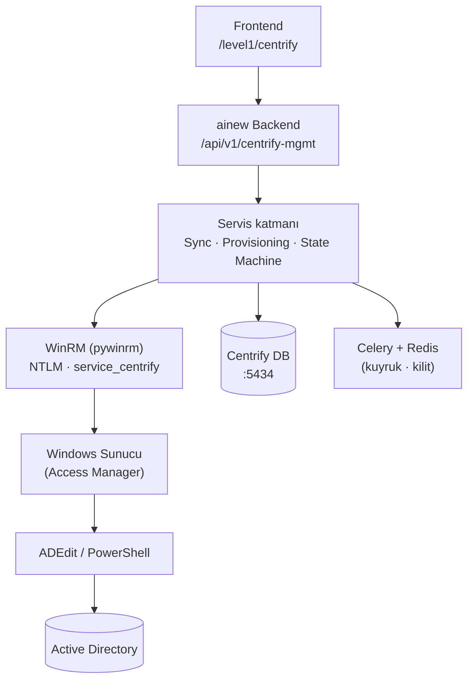

# ainew — Centrify / Delinea Server Suite Rehberi

Modül `centrify` (**Centrify / Delinea**). Delinea Server Suite zone modelini (rol, komut/right, role assignment, computer role) ainew arayüzünden yönetme.

## Mimari



**ainew ana backend'inde çalışır** — Dropt sidecar'da değil. **Ayrı Postgres DB** (`centrify-db :5434`) ile izole çalışır (Dropt modeli). Frontend rotası `/level1/centrify` altındadır ama API çağrıları doğrudan ainew backend'ine gider.

**Temel mimari karar:** ainew doğrudan AD'ye bağlanmaz. Tüm zone yönetimi, Access Manager kurulu **Windows sunucu** üzerinden **WinRM** ile yapılır. ainew'de ADEdit veya centrifydc kurulumu gerekmez.

## Menüler

| Menü | Yol | Kim | İşlem |
|------|-----|-----|--------|
| Zone ağacı | `/level1/centrify` | centrify | Ağaç görünümü, detay, listeler |
| İşlemler | `/level1/centrify/operations` | centrify | Kuyruk, durum, onay |
| Drift | `/level1/centrify/drift` | centrify | Drift uyarıları |
| AI Asistanı | Centrify sayfasında FAB/panel | centrify | Soru-cevap, öneri |
| Ayarlar | Entegrasyonlar sayfası | admin | WinRM bağlantısı, sync aralığı |

## Okuma / yazma ayrımı

- **Ağaç ve listeler** Centrify DB'den gelir — hızlı, WinRM request path'te çağrılmaz.
- **Senkronizasyon** WinRM + PowerShell/ADEdit ile periyodik; zone nesnelerini JSON olarak alır, DB'ye yazar.
- **Yazma** WinRM + ADEdit/PowerShell ile — Windows sunucuya komut gönderir, AD'ye yazar.
- Yazma sonrası hedefli yenileme: etkilenen nesne AD'den okunup DB güncellenir.

## Yönetim durumları

| Durum | Anlam | Uygulama ne yapar |
|-------|-------|-------------------|
| `imported_readonly` | İlk sync'te geldi | Sadece okur; yazmaz/silmez |
| `managed` | Yönetime alındı | Okur + yazar + drift izler |

İlk import'ta tüm nesneler `imported_readonly`. Yetkili kullanıcı seçerek `managed`'e çevirir.

## Durum makinesi (yazma işlemleri)

Her yazma isteği şu akıştan geçer:

```
requested → pending_approval → approved → provisioning → written_to_ad → verified → completed
```

Hata dalları: `failed` · `ambiguous` · `cancelled` · `rolled_back`.

AD replikasyonu ve agent önbelleği nedeniyle etkinleşme dakikalar sürebilir — UI "verildi" yerine gerçek durumu gösterir.

## UI Özellikleri

### Genel yapı
- **Sol panel:** Zone ağacı (lazy load, daraltılabilir)
- **Sağ panel:** Seçili zone'un içeriği (roller, komutlar, computer role'ler, atamalar, UNIX profilleri)
- **Alt panel:** İşlemler kuyruğu (daraltılabilir)

### Rol yönetimi
- **Kopyalama:** Tüm komutlarıyla birlikte klonla; hedef zone ve yeni ad seçimi
- **Overwrite:** Başka rolün komutlarıyla üzerine yaz — diff önizlemesi ile
- **Diff önizleme:** Eklenen (yeşil) / silinen (kırmızı) / aynı kalan komutlar + etkilenen kullanıcı sayısı
- **Sağ tık menüsü:** Düzenle, Kopyala, Komutları Al/Ver, Overwrite, Atamaları Gör, Sil
- **Toplu seçim:** Checkbox ile birden fazla rol seçip toplu işlem

### Komut/Right yönetimi
- Komut path, çalıştıran kullanıcı, auth tipi, match tipi
- Şablon + beyaz liste güvenlik kısıtlamaları
- Zorunlu ikinci onaylayıcı (en riskli operasyon)

### Genel
- Zorunlu gerekçe alanı (tüm yazma işlemlerinde)
- İşlem geçmişi ve durum takibi

## RBAC

Ayrı modül (`centrify`), `level1`'den bağımsız yetki. Granüler yetkiler:

| Yetki | Açıklama |
|-------|----------|
| `centrify.read` | Ağaç, liste, detay |
| `centrify.group_membership` | AD grup üyeliği yönetimi |
| `centrify.role_assignment` | Role assignment oluştur/sil |
| `centrify.role_define` | Rol tanımla/düzenle/kopyala/overwrite |
| `centrify.command_define` | Komut/right tanımla (en riskli) |
| `centrify.approve` | İşlem onayla |

Kendi isteğini kendi onaylama yasak (dört göz).

## Güvenlik

- **Tier 0'a yakın** kabul edilir — komut/right tanımlama en sıkı kısıtlarla.
- Servis hesabı (`service_centrify`) şifre ile WinRM NTLM auth.
- **Lockout koruması:** Circuit breaker; 2 auth fail → tüm işlemler durur. Auth hatalarında otomatik retry **yapılmaz**.
- Kullanıcı girdisi PowerShell'e interpolasyon yapılmaz — parametre olarak geçilir.
- Sırlar şifreli saklanır; kod, log, imajda sır olmasın.
- Centrify'da oluşan hiçbir hata ainew genelini etkilemez (ayrı DB, ayrı Celery queue, circuit breaker).
- ainew → Windows sunucu: yalnızca WinRM (5985/5986). Doğrudan DC'lere bağlantı yoktur.

## Centrify AI Asistanı

Centrify sayfasında yer alan, sayfaya özel bir AI asistanı:

- Delinea resmi dokümanları RAG ile ingest edilir (pgvector)
- Mevcut zone, rol, komut, atama bilgilerini context olarak kullanır
- Sorulara cevap verir, önerilerde bulunur
- Yalnızca okuma tool'ları kullanır (yazma yapmaz)
- ainew mevcut AI altyapısını kullanır (REMOTE_LLM veya Ollama)

Örnek sorular:
- "oracle kullanıcısına /usr/sbin/reboot için dzdo yetkisi nasıl verilir?"
- "sysadmin rolüne benzer bir rol var mı?"
- "bu komut zaten tanımlı mı?"

## Drift tespiti

`managed` nesnelerde AD'deki gerçek durum ile istenen durum karşılaştırılır. Fark varsa alarm üretilir ve UI'da gösterilir. Otomatik düzeltme varsayılan olarak kapalı.

## Entegrasyonlar bağlantısı

Centrify entegrasyonu için **4 alan** yapılandırılır:

| Alan | Açıklama |
|------|----------|
| Windows sunucu | Access Manager kurulu sunucunun IP/hostname'i |
| WinRM portu | Varsayılan 5985 |
| Kullanıcı adı | `service_centrify` |
| Şifre | CredentialManager ile şifreli saklanır |

**Not:** Mevcut Ayarlar → Kimlik/AD yapılandırmasından **ayrıdır**. AD host/port, Zone Base DN, keytab gibi ayarlar gerekmez — Windows sunucu zaten domain-joined ve Access Manager kurulu.

"Test" butonu: WinRM bağlantısı + ADEdit varlık kontrolü + zone listesi okuma.
Başarılıysa Level 1 menüsünde "Centrify" linki görünür.

## Dropt ile ilişki

Dropt'taki mevcut `CentrifyCredential` (hostname leave/join) **ayrı kalır, dokunulmaz**. İki farklı kullanım durumu:

| Bileşen | Amaç | Nerede |
|---------|------|--------|
| Dropt `centrify_store` | Hostname değişikliğinde `adleave`/`adjoin` | Dropt backend |
| Centrify modülü | Zone, role, assignment yönetimi | ainew ana backend |

## Aşamalı teslim

0. **Spike** — WinRM ile Windows sunucuya bağlanıp ADEdit/PowerShell testi
1. **Salt okunur** — DB + sync + ağaç + listeler + drift göstergesi
2. **Yazma** — Durum makinesi + kuyruk + audit + onay + role assignment
3. **Rol yönetimi** — CRUD + kopyala + overwrite + diff önizleme + computer role
4. **Komut/Right** — Şablon + beyaz liste + zorunlu onay
5. **AI Asistanı** — RAG + chat endpoint
6. **Sertleştirme** — Yük testi, alarm, runbook
