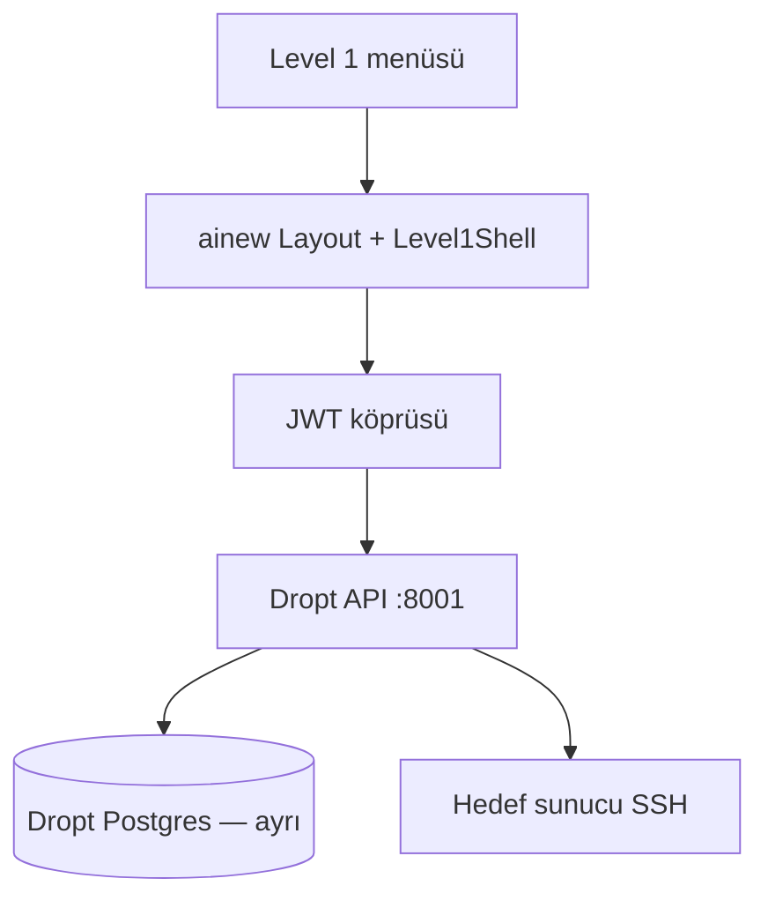

# ainew — Level 1 GUIDE

Modül `level1` (**İşletim Level 1**). ainew kabuğuna gömülü Dropt: day-2 Linux işletimi, talepli ve önizlemeli.

## Mimari

`DROPT_API_URL`, `AINEW_BRIDGE_SECRET`. **ainew Timescale ile Dropt DB karıştırılmaz.** Envanter: ainew/vCenter satırı Dropt `TargetServer` ile IP/hostname/UUID eşlenir.

## Menüler

| Menü | Yol | Kim | İşlem |
|------|-----|-----|--------|
| Operasyon merkezi | `/level1` | level1 | Liste, senkron, konsol |
| Konsol | `/level1/console/:id` | level1 | Özet + sihirbaz |
| Sihirbazlar | `/level1/ops/…` | level1 | Çoklu / sağ tık |
| İşler | `/level1/jobs` | level1 | Kuyruk ve detay |
| Denetim | `/level1/audit` | admin | Denetim izi |
| Ayarlar | `/level1/settings` | admin | Dropt ayarları |

## Sihirbaz kataloğu

terminal · yerel kullanıcılar · hostname · reboot · servisler · sudoers · dosya sistemi / LVM · paketler · yol izinleri · log toplama · limits · sysctl · ağ / VLAN · ASM · posta.

## Zorunlu iş akışı

Talep ID → **Preview** → **Apply** → `/level1/jobs`. Otomatik apply yok.

## Ayarlar (admin)

Otomasyon, posta, asistan, paket repo, Centrify, yedek. Kullanıcı yönetimi ainew **Kullanıcılar** sayfasındadır (Dropt kullanıcı UI’si gömülüdür).

## Senaryo

level1 yetkisi → operasyon merkezi → konsol → filesystem → Talep → Preview → Apply → işler.

## Level 1 olmayanlar

Linux `/packages` (farklı motor), virt sohbet, OCP asistanı, ainew Ayarlar → SSH (L1 secret deposu değil).

## Sorun giderme

Dropt 8001, köprü secret, eşleme, Preview’suz Apply yok, yanlış Postgres.
